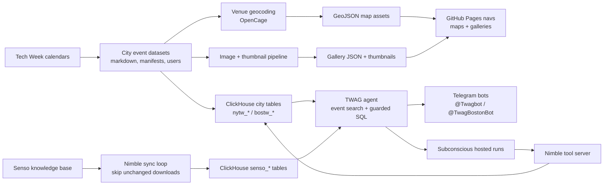

# TWAG Tech Week Bot

TWAG is a data-backed event guide for NY Tech Week and Boston Tech Week
2026. Ask it practical questions about events, hosts, neighborhoods, topics,
times, RSVP status, and capacity; or browse the public maps and galleries.

No setup is needed to try it. Use the browser terminal for the fastest path, or
open the bot for the city you care about.

## Try It

|  | NY Tech Week | Boston Tech Week |
| --- | --- | --- |
| Bot: terminal | [Open browser terminal](http://46.224.170.22:8765/terminal?city=nyc) | [Open browser terminal](http://46.224.170.22:8765/terminal?city=boston) |
| Bot: Telegram | [@Twagbot](https://t.me/Twagbot) | [@TwagBostonBot](https://t.me/TwagBostonBot) |
| Bot: Telegram QR |  |  |
| Gallery | [Browse gallery](https://natea.github.io/twag/events_gallery_nyc.html) | [Browse gallery](https://natea.github.io/twag/events_gallery_boston.html) |
| Map | [Open map](https://natea.github.io/twag/events_map_nyc.html) | [Open map](https://natea.github.io/twag/events_map_boston.html) |

The browser terminal is the web alternative to Telegram and is preconfigured
for public access on the deployed host. It supports `/city nyc`, `/city boston`,
`/map`, `/help`, and follow-up requests like `more`.

## Credits

- **Atin** started the agent-friendly NY Tech Week event mirror that made this workflow possible.
- **Aleks** wired the ClickHouse, Senso, Nimble, Telegram, deployment, and production hardening pieces together.
- **Nate Aune** ported the experience to Boston, rebuilt the static map/gallery navigation, and pushed the multi-city direction.

## How It Works

The repo keeps two Tech Week datasets in a shared shape: event markdown, manifests, hosts, users, venues, and generated static assets. `TWAG_CITY` selects which city is active. NYC uses `data/nytw-2026-for-agents` and ClickHouse tables prefixed with `nytw_*`; Boston uses `data/bostontw-2026-for-agents` and `bostw_*`.

The data pipeline normalizes event files, geocodes venues with OpenCage, exports GeoJSON for the map, downloads event images once, and creates committed thumbnails for the gallery. Full-resolution images stay ignored because they are large; generated thumbnails and gallery JSON are the deployable web assets.

The agent side loads city data into ClickHouse, mirrors the Senso knowledge base into `senso_*` tables, and exposes a guarded query path to Subconscious and Telegram. The Telegram workers run as independent long-polling processes, one token per city, so the NY and Boston bots can coexist on one host.

What it took: city-aware config, two event datasets, hundreds of geocoded venues, a static map/gallery build, image compression, ClickHouse loaders, a Senso sync cache that avoids re-downloading known files, read-only SQL guardrails, per-city Telegram token resolution, systemd deploy units, and tests for the multi-city behavior.

## Architecture



## Setup And Config

Create a local environment and install the package:

```bash
python3 -m venv .venv
source .venv/bin/activate
pip install -e .
cp .env.example .env
```

City selection:

| City slug | Event range | Dataset | ClickHouse prefix |
| --- | --- | --- | --- |
| `nyc` | June 1-7, 2026 | `data/nytw-2026-for-agents` | `nytw` |
| `boston` | May 24-31, 2026 | `data/bostontw-2026-for-agents` | `bostw` |

Use `TWAG_CITY=nyc` or `TWAG_CITY=boston` in `.env`, or pass `--city` to CLI commands when you want to override the environment:

```bash
twag --city boston inspect-nytw --limit 5
```

### Required Services

ClickHouse:

```bash
CLICKHOUSE_HOST=
CLICKHOUSE_PORT=8443
CLICKHOUSE_USERNAME=default
CLICKHOUSE_PASSWORD=
CLICKHOUSE_DATABASE=default
CLICKHOUSE_SECURE=true
```

Subconscious agent endpoint:

```bash
SUBCONSCIOUS_API_KEY=
SUBCONSCIOUS_BASE_URL=https://api.subconscious.dev/v1
SUBCONSCIOUS_MODEL=subconscious/tim-qwen3.6-27b
SUBCONSCIOUS_RUN_ENGINE=tim-gpt
```

Telegram bots:

```bash
NYC_TELEGRAM_BOT_TOKEN=
BOSTON_TELEGRAM_BOT_TOKEN=
TELEGRAM_ALLOWED_CHAT_IDS=
TELEGRAM_POLL_TIMEOUT=30
TELEGRAM_REQUEST_TIMEOUT=45
```

Define one token per city. `TWAG_CITY=nyc` reads `NYC_TELEGRAM_BOT_TOKEN`; `TWAG_CITY=boston` reads `BOSTON_TELEGRAM_BOT_TOKEN`. In production, run only one polling process per Telegram token.

Optional Senso and Nimble settings:

```bash
SENSO_API_KEY=
SENSO_SYNC_ENABLED=true
SENSO_SYNC_INTERVAL_SECONDS=3600
SENSO_SYNC_REPLACE=false

NYTW_TOOL_URL=
NYTW_TOOL_TOKEN=
NYTW_TOOL_HOST=0.0.0.0
NYTW_TOOL_PORT=8000
TWAG_NIMBLE_COMMAND=.venv/bin/twag-nytw-tool-server
```

### Load And Inspect Data

```bash
twag --city nyc load-nytw --replace
twag --city boston load-nytw --replace

twag --city nyc inspect-nytw --limit 5
twag --city boston inspect-nytw --limit 5

twag sync-senso
twag sync-senso-log --limit 5 --item-limit 50
```

The Senso sync stores remote metadata and content hashes so repeated runs can skip files that have not changed.

### Build Maps And Galleries

```bash
TWAG_CITY=boston twag geocode-venues
TWAG_CITY=boston twag build-geojson
TWAG_CITY=boston twag build-thumbnails
TWAG_CITY=boston twag build-gallery
```

The same commands work for `TWAG_CITY=nyc`. The generated map HTML reads `docs/<city>.geojson`; the gallery reads `docs/<city>_gallery.json` and thumbnails under `docs/<city>/thumbs/`.

Map links generated by the bot and local terminal use `TWAG_PUBLIC_MAP_BASE_URL`
as the GitHub Pages root and append the active city's map file:

```bash
TWAG_PUBLIC_MAP_BASE_URL=https://natea.github.io/twag/
# nyc    -> https://natea.github.io/twag/events_map_nyc.html
# boston -> https://natea.github.io/twag/events_map_boston.html
```

To preview locally:

```bash
cd docs
python3 -m http.server 8085
```

Then open `http://localhost:8085/events_map_boston.html`, `http://localhost:8085/events_gallery_boston.html`, `http://localhost:8085/events_map_nyc.html`, or `http://localhost:8085/events_gallery_nyc.html`.

### Run The Local Operator Terminal

The local browser terminal runs against your machine's `.env` and binds the
backend to `127.0.0.1` by default. It does not replace or talk to the Telegram
workers.

Start the backend in one shell:

```bash
twag terminal-server
```

Then open:

```text
http://127.0.0.1:8765/terminal
```

The optional Node TUI is still available for shell-only operation:

```bash
cd terminal
npm run tui
```

Useful local terminal settings:

```bash
TWAG_TERMINAL_HOST=127.0.0.1
TWAG_TERMINAL_PORT=8765
TWAG_TERMINAL_URL=http://127.0.0.1:8765
```

Inside the terminal, use `/city nyc`, `/city boston`, `/verbose`, `/quiet`,
`/map`, `/help`, `more`, and `/exit`.

### Run The Bots

For local development, run each city in its own shell:

```bash
TWAG_CITY=nyc TELEGRAM_AGENT_LOCK_FILE=.telegram-agent-nyc.lock twag telegram-agent
TWAG_CITY=boston TELEGRAM_AGENT_LOCK_FILE=.telegram-agent-boston.lock twag telegram-agent
```

On Ubuntu, the deploy scripts install separate systemd units for both bots,
Nimble, and the browser terminal:

```bash
RUN_REMOTE_INSTALL=true deploy/ubuntu/rsync.privileged.sh

sudo systemctl enable --now twag-telegram-agent@$USER.service
sudo systemctl enable --now twag-telegram-agent-boston@$USER.service
sudo systemctl enable --now twag-nimble@$USER.service
sudo systemctl enable --now twag-terminal@$USER.service

deploy/ubuntu/control.sh status
```

### Deploy The Browser Terminal

The rsync installer installs `twag-terminal@.service`, which runs the browser
terminal backend and serves the JS terminal at `/terminal`.

For the default operator-only deployment, keep it bound to remote localhost:

```bash
TWAG_TERMINAL_HOST=127.0.0.1
TWAG_TERMINAL_PORT=8765
TWAG_TERMINAL_TOKEN=
```

The deployed browser terminal listens on the remote host's `127.0.0.1` by
default. Use an SSH tunnel from your machine before opening it:

```bash
ssh -L 8765:127.0.0.1:8765 "$USER@your-ubuntu-host"
open http://127.0.0.1:8765/terminal
```

To expose the terminal directly as a public web URL, bind the service to
`0.0.0.0`, leave `TWAG_TERMINAL_TOKEN` empty, and restart it:

```bash
sudoedit /etc/twag/twag.env
# TWAG_TERMINAL_HOST=0.0.0.0
# TWAG_TERMINAL_PORT=8765
# TWAG_TERMINAL_TOKEN=

sudo systemctl restart twag-terminal@$USER.service
```

Then open:

```text
http://<host>:8765/terminal
```

For the current deployed host, use:

```text
http://46.224.170.22:8765/terminal
```

City-specific entry URLs are:

```text
http://46.224.170.22:8765/terminal?city=nyc
http://46.224.170.22:8765/terminal?city=boston
```

After changes, restart just the browser terminal with:

```bash
sudo systemctl restart twag-terminal@$USER.service
```

Useful logs:

```bash
journalctl -u twag-telegram-agent@$USER.service -f
journalctl -u twag-telegram-agent-boston@$USER.service -f
journalctl -u twag-nimble@$USER.service -f
journalctl -u twag-terminal@$USER.service -f
```

Telegram read timeouts during long polling can happen occasionally. The agent logs them as transient and retries with backoff; investigate only if they cluster, exceed `TELEGRAM_REQUEST_TIMEOUT`, or coincide with duplicate polling processes for the same token.
