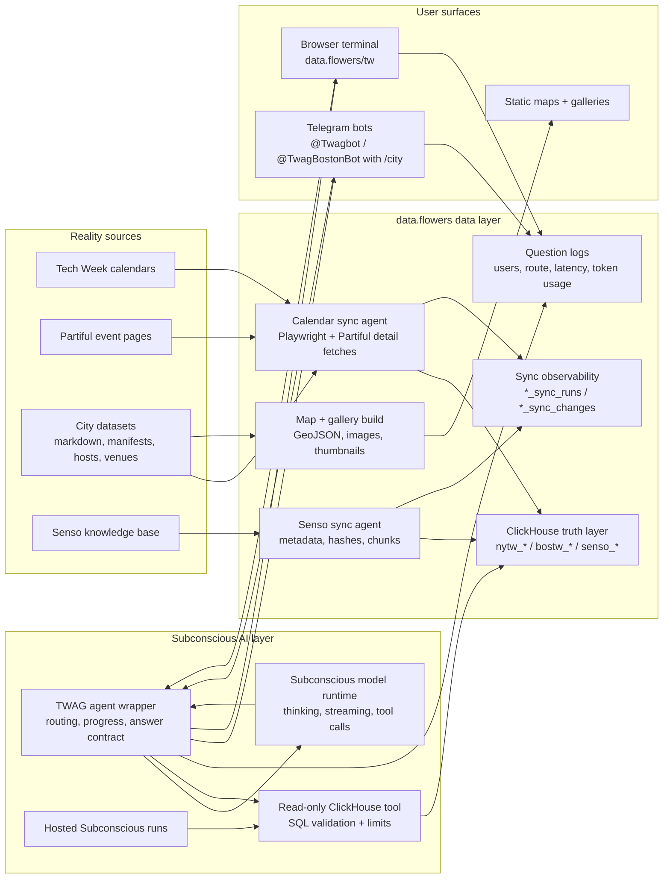

# TWAG Tech Week Agent Guide

TWAG is a data-backed event guide for NY Tech Week and Boston Tech
Week 2026. Ask it practical questions about events, hosts, neighborhoods,
topics, times, RSVP status, and capacity; or browse the public maps and
galleries.

The project is an example of the core data.flowers idea: AI gets useful when it
is connected to clean, current, queryable data. TWAG keeps messy event-calendar
reality, synced knowledge-base context, and user questions in one loop so the
agent can answer from live data instead of guessing.

No setup is needed to try it. Use the browser terminal or open the Telegram bot
for the city you care about.

Sponsored by [data.flowers](https://data.flowers/) (data, hosting, and
engineering) and [Subconscious](https://www.subconscious.dev/) (custom LLM
model and AI ops).

## Credits

- **[Atin Woodard from Stage11](https://github.com/Stage-11-Agentics/)**
  created the agent-friendly NY Tech Week database.
- **[Aleks Jakulin from data.flowers](https://jakul.in)** built the end-user
  AI/data product, wiring ClickHouse, Telegram, data sync, deployment, and
  production hardening pieces together.
- **[Nate Aune](https://github.com/natea)** lead in the multi-city direction by
  adding support for Boston and creating the static map and gallery navigation.

## Try It

|  | NY Tech Week | Boston Tech Week |
| --- | --- | --- |
| Bot: terminal | [Open terminal](https://data.flowers/tw/?city=nyc) | [Open terminal](https://data.flowers/tw/?city=boston) |
| Gallery | [Browse gallery](https://natea.github.io/twag/events_gallery_nyc.html) | [Browse gallery](https://natea.github.io/twag/events_gallery_boston.html) |
| Map | [Open map](https://natea.github.io/twag/events_map_nyc.html) | [Open map](https://natea.github.io/twag/events_map_boston.html) |
| Bot: Telegram | [@Twagbot](https://t.me/Twagbot) | [@TwagBostonBot](https://t.me/TwagBostonBot) |
| Bot: Telegram QR |  |  |

The browser terminal is the web alternative to Telegram. It supports `/city nyc`,
`/city boston`, `/map`, `/help`, and follow-up requests like `more`.

## How It Works

TWAG has three connected layers:

1. **Reality into data.** Sync jobs ingest Tech Week calendars, Partiful event
   detail, Senso knowledge-base content, venues, images, hosts, and generated
   assets. They normalize the changing outside world into ClickHouse tables and
   static web assets.
2. **Data into AI.** The TWAG agent gives Subconscious a guarded read-only
   query tool over ClickHouse. Event discovery goes to city event tables first;
   background and explanatory context can draw from synced `senso_*` tables.
3. **AI back to users.** Telegram and the browser terminal expose the agent with
   city-aware routing, follow-up pagination, visible progress updates, split
   long responses, and production logging of questions, users, latency, and
   token usage.

The repo keeps two Tech Week datasets in a shared shape: event markdown,
manifests, hosts, users, venues, and generated static assets. `TWAG_CITY`
selects which city is active. NYC uses `data/nytw-2026-for-agents` and
ClickHouse tables prefixed with `nytw_*`; Boston uses
`data/bostontw-2026-for-agents` and `bostw_*`.

The data pipeline normalizes event files, geocodes venues with OpenCage, exports
GeoJSON for the map, downloads event images once, and creates committed
thumbnails for the gallery. Full-resolution images stay ignored because they are
large; generated thumbnails and gallery JSON are the deployable web assets.

The agent side loads city data into ClickHouse, mirrors the Senso knowledge base
into `senso_*` tables, and exposes a guarded query path to Subconscious,
Telegram, and the browser terminal. One Telegram long-polling process can serve
the unified bot or both city bot accounts; users can still switch per chat with
`/city nyc` or `/city boston`.

What it took: city-aware config, two event datasets, hundreds of geocoded
venues, a static map/gallery build, image compression, ClickHouse loaders, a
Senso sync cache that avoids re-downloading known files, read-only SQL
guardrails, Telegram city switching, rate-limit handling, systemd
deploy units, and tests for the multi-city behavior.

## Subconscious + data.flowers

TWAG is deliberately split between **data infrastructure** and **AI execution**:

- **data.flowers** supplies the data loop: extract, normalize, sync, query,
  observe, and deploy. The goal is to make real-world data reliable enough that
  an AI system can use it directly.
- **Subconscious** supplies the hosted model runtime for agentic reasoning over
  that data. TWAG uses the Subconscious chat-completions endpoint with a custom
  model, controlled thinking, streaming, token accounting, and tool calls into a
  ClickHouse query service.
- **ClickHouse** is the shared truth layer. Event rows, calendar snapshots,
  row-level sync changes, Senso documents, and Senso chunks live in tables that
  are fast enough for interactive search.

Subconscious is visible in TWAG in a few concrete ways:

- The model can decide which read-only ClickHouse query is useful, while SQL
  guardrails reject mutations and unrelated tables.
- The agent can reason while deciding what to retrieve, then turns thinking off
  for final answer presentation so users get results instead of internal prose.
- Verbose mode can expose the raw thinking stream for debugging, while Telegram
  protects users from clipped messages by splitting long output and replacing
  old streamed reasoning with `...` before Telegram limits are hit.
- Hosted Subconscious runs can call a public TWAG tool server, so the same data
  interface can be used outside the Telegram/browser surfaces.

The data.flowers side is the other half of the system: TWAG is not just a bot
prompt. It is a continuously refreshed data product where sync logs, question
logs, token usage, maps, galleries, and queryable tables all make the AI layer
more grounded and inspectable.

## Architecture



## Setup And Config

Create a local environment and install the package:

```bash
python3 -m venv .venv
source .venv/bin/activate
pip install -e .
cp .env.example .env
```

City selection:

| City slug | Event range | Dataset | ClickHouse prefix |
| --- | --- | --- | --- |
| `nyc` | June 1-7, 2026 | `data/nytw-2026-for-agents` | `nytw` |
| `boston` | May 24-31, 2026 | `data/bostontw-2026-for-agents` | `bostw` |

Use `TWAG_CITY=nyc` or `TWAG_CITY=boston` in `.env`, or pass `--city` to CLI
commands when you want to override the environment:

```bash
twag --city boston inspect-nytw --limit 5
```

### Required Services

ClickHouse:

```bash
CLICKHOUSE_HOST=
CLICKHOUSE_PORT=8443
CLICKHOUSE_USERNAME=default
CLICKHOUSE_PASSWORD=
CLICKHOUSE_DATABASE=default
CLICKHOUSE_SECURE=true
```

Subconscious agent endpoint:

```bash
SUBCONSCIOUS_API_KEY=
SUBCONSCIOUS_BASE_URL=https://api.subconscious.dev/v1
SUBCONSCIOUS_MODEL=subconscious/tim-qwen3.6-27b
SUBCONSCIOUS_RUN_ENGINE=tim-gpt
SUBCONSCIOUS_ENABLE_THINKING=true
```

`SUBCONSCIOUS_ENABLE_THINKING=true` lets the model use reasoning for retrieval
and query planning. TWAG disables thinking on the final presentation turn so
Telegram and terminal users see answers, not formatting deliberation.

Telegram bot:

```bash
TELEGRAM_BOT_TOKEN=
NYC_TELEGRAM_BOT_TOKEN=
BOSTON_TELEGRAM_BOT_TOKEN=
TELEGRAM_ALLOWED_CHAT_IDS=
TELEGRAM_POLL_TIMEOUT=30
TELEGRAM_REQUEST_TIMEOUT=45
TELEGRAM_QUESTION_LOG_PATH=logs/twag-telegram-questions.jsonl
```

Run one Telegram polling process. Users can switch datasets inside the chat
with `/city nyc` or `/city boston`. `TWAG_CITY` only sets the default city for
new chats when `TELEGRAM_BOT_TOKEN` is set. If `TELEGRAM_BOT_TOKEN` is unset,
the same process polls each configured city account from
`NYC_TELEGRAM_BOT_TOKEN` and/or `BOSTON_TELEGRAM_BOT_TOKEN`; new chats in those
accounts start in that account's city, and `/city` still works.

Telegram logs each answered question, user/chat metadata, route, duration,
answer text, and token usage as JSONL when `TELEGRAM_QUESTION_LOG_PATH` is set.
The bot also handles Telegram `429` rate limits by suppressing optional status
and streaming edits during cooldown, then retrying final answer delivery once
after Telegram's requested `retry_after` window.

Optional Senso and sync-agent settings:

```bash
SENSO_API_KEY=
SENSO_SYNC_ENABLED=true
SENSO_SYNC_INTERVAL_SECONDS=3600
SENSO_SYNC_REPLACE=false

TECHWEEK_CALENDAR_SYNC_ENABLED=true
TECHWEEK_CALENDAR_SYNC_CITIES=nyc,boston
TECHWEEK_CALENDAR_SYNC_INTERVAL_SECONDS=21600
TECHWEEK_EVENT_FETCH_CONCURRENCY=3
TECHWEEK_CALENDAR_MAX_SCROLL_TICKS=260
TECHWEEK_CALENDAR_PAGE_DELAY_SECONDS=0.1

NYTW_TOOL_URL=
NYTW_TOOL_TOKEN=
NYTW_TOOL_HOST=localhost
NYTW_TOOL_PORT=8000
TWAG_SYNC_AGENT_COMMAND=.venv/bin/twag-sync-agent
```

### Load And Inspect Data

```bash
twag --city nyc load-nytw --replace
twag --city boston load-nytw --replace

twag --city nyc inspect-nytw --limit 5
twag --city boston inspect-nytw --limit 5

twag sync-senso
twag sync-senso-log --limit 5 --item-limit 50
twag sync-calendars --cities nyc,boston
twag sync-calendar-log --limit 5 --item-limit 50
```

The Senso sync stores remote metadata and content hashes so repeated runs can
skip files that have not changed.
The calendar sync uses the public Tech Week calendar API plus gentle Partiful
detail fetches, not Nimble. It writes append-only snapshots into
`nytw_calendar_events` / `bostw_calendar_events`, exposes the latest complete
run through `nytw_current_events` / `bostw_current_events`, and records
row-level changes in `nytw_sync_changes` and `bostw_sync_changes`.

Senso is treated as a content expansion layer, not a live dependency in the
answer path. The sync process turns Senso nodes, documents, and chunks into
ClickHouse rows so Subconscious can query contextual material with the same
guardrails as event data. That keeps background knowledge close to the event
tables and makes it available for richer answers without letting the model roam
across untracked remote state.

### Build Maps And Galleries

```bash
TWAG_CITY=boston twag geocode-venues
TWAG_CITY=boston twag build-geojson
TWAG_CITY=boston twag build-thumbnails
TWAG_CITY=boston twag build-gallery
```

The same commands work for `TWAG_CITY=nyc`. The generated map HTML reads
`docs/<city>.geojson`; the gallery reads `docs/<city>_gallery.json` and
thumbnails under `docs/<city>/thumbs/`.

To preview locally:

```bash
cd docs
python3 -m http.server 8085
```

Then open `http://localhost:8085/events_map_boston.html`,
`http://localhost:8085/events_gallery_boston.html`,
`http://localhost:8085/events_map_nyc.html`, or
`http://localhost:8085/events_gallery_nyc.html`.

### Run The Bots

For local development, run one Telegram bot shell:

```bash
TWAG_CITY=nyc TELEGRAM_AGENT_LOCK_FILE=.telegram-agent.lock twag telegram-agent
```

On Ubuntu, the deploy scripts install one Telegram bot, the sync agent, and the
browser terminal backend:

```bash
RUN_REMOTE_INSTALL=true \
DEPLOY_TERMINAL_STATIC=true \
REMOTE_SERVICE_ACTION=restart \
deploy/ubuntu/deploy.sh
```

The deploy script loads remotes from the ignored `.env`, syncs the backend,
syncs `/etc/twag/twag.env`, publishes the static browser shell when
`DEPLOY_TERMINAL_STATIC=true`, and restarts the three systemd services by
default. For a first deploy where services are not enabled yet, use
`REMOTE_SERVICE_ACTION=start`.

The browser terminal has two deployable pieces: the Python backend on the
process host, and the static shell served at `/tw/` on the public web host.
Do not hand-edit cache-busting query strings. The terminal index uses
placeholders, and the deploy builder replaces them with SHA-256 content hashes
from `app.js` and `styles.css`.

Build the static shell locally:

```bash
uv run python scripts/build_terminal_static.py --output build/terminal-static --clean
```

Publish it from the deployment environment:

```bash
TWAG_TERMINAL_STATIC_REMOTE=deploy-user@static-host.example \
TWAG_TERMINAL_STATIC_REMOTE_DIR=/path/to/public/tw \
deploy/deploy-static.sh
```

Set `DEPLOY_TERMINAL_STATIC=true` to make the Ubuntu deploy run the same
static publish step after syncing the backend. This requires
`TWAG_TERMINAL_STATIC_REMOTE` in `.env`; the script now fails before syncing if
that target is missing. CI/CD should run the static builder and tests; if
`app.js` or `styles.css` changes, the generated URL changes automatically.

The browser terminal keeps lightweight session snapshots in
`TWAG_TERMINAL_SESSION_DIR` so follow-up commands such as `more` can survive a
backend restart. The default deployed path is
`/var/log/twag/terminal-sessions`.

The terminal backend also writes per-turn JSONL traces to
`TWAG_TERMINAL_TRACE_DIR` for later debugging and evaluation. These traces can
include hidden planning/detail streams, ClickHouse SQL detail callbacks,
visible answer deltas, route metadata, mode flags, token usage, and the final
answer. They are not shown in the terminal unless verbose output is enabled.
The default deployed path is `/var/log/twag/terminal-traces`; cap each record
with `TWAG_TERMINAL_TRACE_CHAR_LIMIT`.

Set `TWAG_PUBLIC_TERMINAL_BASE_URL` to the public terminal backend URL, for
example `https://data.flowers/tw/terminal`. Filtered terminal search-result
maps remain disabled by default with `TWAG_TERMINAL_RESULT_MAPS_ENABLED=false`
until the canonical static map pages support loading a filtered GeoJSON via
`result_url`.

Useful logs:

```bash
journalctl -u twag-telegram-agent@$USER.service -f
journalctl -u twag-sync-agent@$USER.service -f
journalctl -u twag-terminal@$USER.service -f
```

The helper script wraps the same logs and can show bounded output:

```bash
deploy/ubuntu/control.sh terminal-logs
LOG_SINCE="2 hours ago" LOG_FOLLOW=false deploy/ubuntu/control.sh terminal-logs
deploy/ubuntu/control.sh nginx-diagnose
```

Telegram read timeouts during long polling can happen occasionally. The agent
logs them as transient and retries with backoff; investigate only if they
cluster, exceed `TELEGRAM_REQUEST_TIMEOUT`, or coincide with duplicate polling
processes for the same token.
